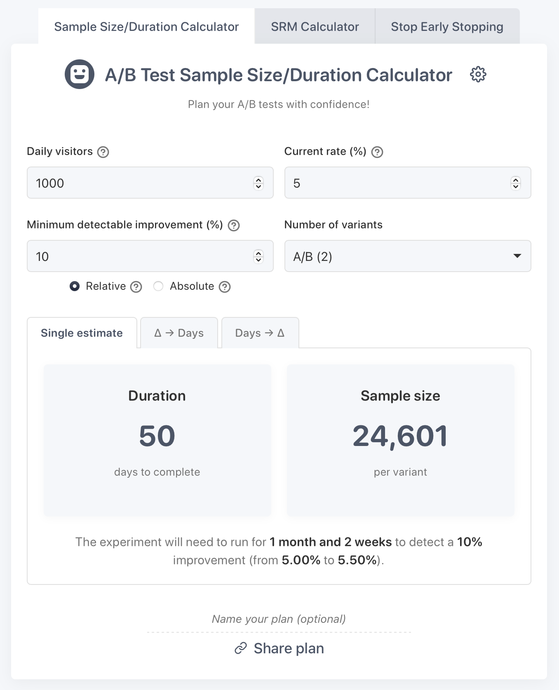

    
     
    
    
    
     
     
    
     
    <a href="https://calculator.osc.garden">Try it out!</a>
     

<h3 align="center">Plan your A/B tests with confidence</h3>

## Features

- **Precise**: Less than 1% deviation from [Python's scipy](https://scipy.org/)'s implementation
- **Duration estimation**: Calculate how long your experiment needs to run
- **MDE estimation**: Given a number of days, see what effect you could detect
- **Table with multiple values**: Compare different MDE or duration scenarios to evaluate test sensitivity vs. duration tradeoffs
- **Multiple variants**: Plan tests with up to 5 variants (A/B/C/D/E) (need more? [open an issue](https://github.com/welpo/ab-test-calculator/issues/new?&labels=feature))
- **Flexible MDE options**: Calculate for relative (percentage) or absolute (percentage point) improvements
- **Advanced settings**: Configure significance level, statistical power, test type, multiple testing corrections…
- **Traffic distribution**: Set custom traffic allocation between variants
- **Shareable plans**: Generate links to share test plans with colleagues
- **Private**: Works entirely client-side with no data sent to any server

## How it works

This calculator uses statistical power analysis to determine the required sample size for A/B tests:

1. **You provide**:
   - Daily visitors to the test area
   - Current (conversion, sign-up…) rate
   - Minimum detectable effect (MDE) - the smallest improvement worth detecting
   - Number of variants in your test

2. **The calculator determines**:
   - Required sample size for each variant using the two-proportion z-test formula:
     $n = \frac{(z_α + z_β)^2 × (p_1 × (1 - p_1) + p_2 × (1 - p_2))}{(p_2 - p_1)^2}$
   - Test duration based on your traffic and variant distribution:
     $Duration = \frac{Required\,Sample\,Size}{Daily\,Visitors × Traffic\,Percentage ÷ Number\,of\,Variants}$

3. **You can visualise**:
   - Duration in days to complete the test
   - Sample size needed per variant
   - How changing your MDE affects test duration
   - What improvements you can reliably detect in a fixed timeframe

The calculator uses [Acklam's algorithm](https://web.archive.org/web/20151030215612/http://home.online.no/~pjacklam/notes/invnorm/) to compute z-values from standard normal distributions.

## Contributing

Please do! I'd appreciate bug reports, improvements (however minor), suggestions…

The calculator uses vanilla JavaScript, HTML, and CSS. To run locally:

1. Clone the repository: `git clone https://github.com/welpo/ab-test-calculator.git`
2. Navigate to the project directory: `cd ab-test-calculator`
3. Start a local server: `python3 -m http.server`
4. Visit `http://localhost:8000` in your browser

The important files are:

- `index.html`: Basic structure
- `styles.css`: Styles
- `app.js`: Logic
- `tests.js`: Tests, generated with `ab-test-calculator/ab_test_generator.py` (add `?test` to the URL to run validation tests)

## Need help?

Something not working? Have an idea? Let me know!

- Questions or ideas → [Start a discussion](https://github.com/welpo/ab-test-calculator/discussions)
- Found a bug? → [Report it here](https://github.com/welpo/ab-test-calculator/issues/new?&labels=bug)
- Feature request? → [Let me know](https://github.com/welpo/ab-test-calculator/issues/new?&labels=feature)

## License

This A/B test calculator is free software: you can redistribute it and/or modify it under the terms of the [GNU Affero General Public License as published by the Free Software Foundation](./COPYING), either version 3 of the License, or (at your option) any later version.
